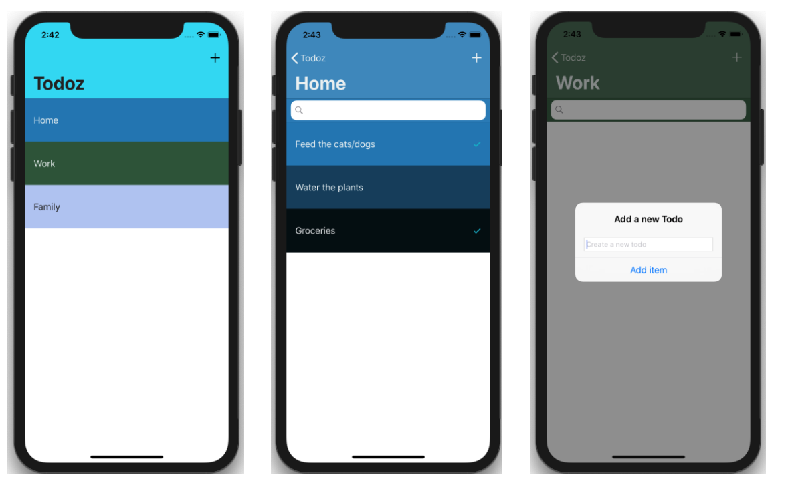

# Todoz

# Table of Contents
* I.	General info
* II. 	Technologies
* III.	Setup
* IV.	Architecture

## I. General info
This project is a simple To-Do application for iOS, where you can organise your different tasks in multiple To-Do lists and categories.  
	
## II. Technologies
Project is created using:
- Swift 5
- Chameleon color Framework
- Realm Data Framework
	
## III. Setup
You will need a Mac running Xcode to run this application on your device or your simulator.
* Download the project files to your computer.
* Run the "Todoz.xcworkspace" file.

## IV. Architecture

## Design Pattern
Model-View-Controller (MVC)

### IV.I. Data Model
* Creation of two Swift files that contains the data model of Categories and Items.
* The relationship between Categories and Items if made using RealmSwift

### IV.II. Views
The views are created in the Main.storyboard file. it was used to:
* Create a TableView
* Embed the view in a Navigation Controller
* Create a Segue to another TableView

### IV.III. Controllers
* A SwipeCellKit Cocoapod has been added to this application to add the option to delete a tableview cell by swiping entirely a cell to the left. To make this functionality available on the whole application, a main controller has been created "**SwipeCellViewController**".
* Two controllers have been created (**CategoryViewController** and **TodoListViewController**) that inherits from "**SwipeCellViewController**" Class.
